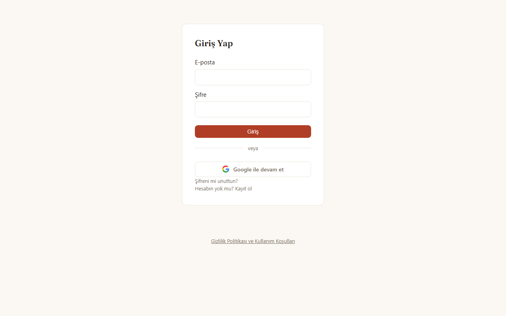
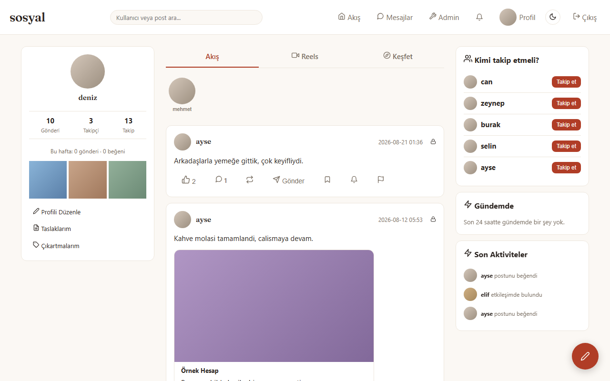
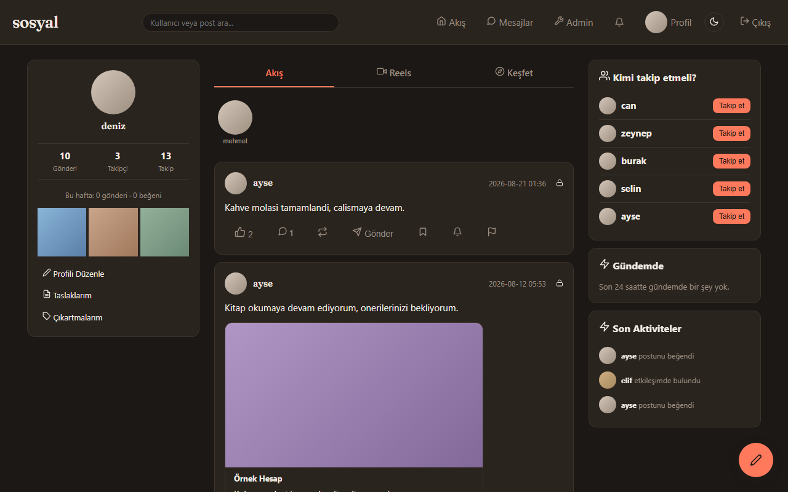
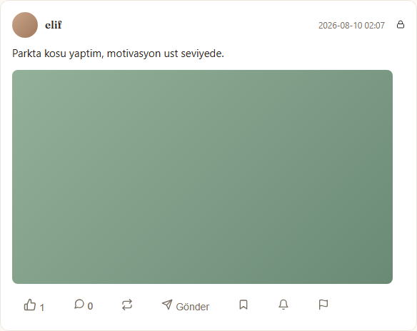
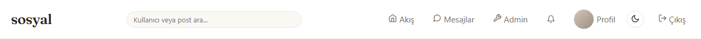
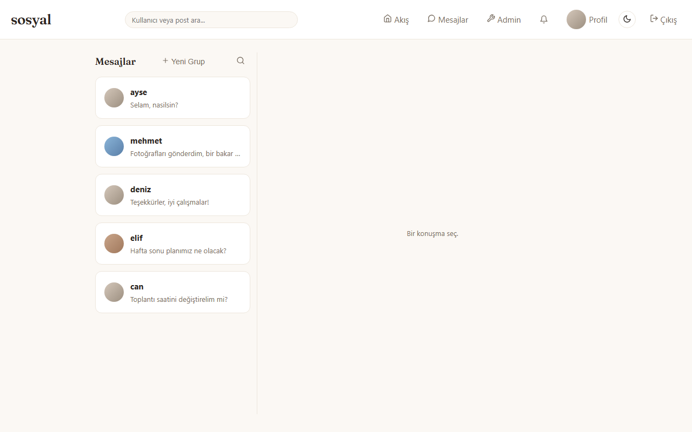
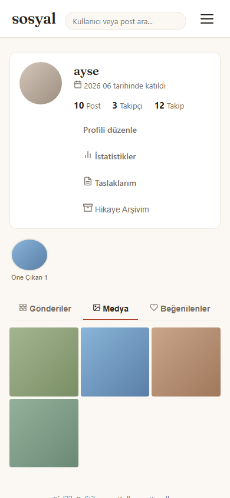

# sosyal

[Türkçe](README.md)

## Description

**sosyal** is a small-scale social media web app built for a group of friends, running on Flask + Supabase. The server side is rendered with Jinja2; Supabase provides the database, authentication, file storage and real-time channels. There is no frontend framework — a single global stylesheet plus vanilla JavaScript, with the scripts concatenated and minified by esbuild via `npm run build:js`. The app ships a feed, profiles, stories (with archive and highlights), polls, reels, hashtags/trending, search/discovery and a full messaging layer (1:1 and group, voice/video calls, voice messages, stickers/GIFs, emoji reactions); notifications are delivered over web push and FCM. The same backend also exposes a separate Bearer-token REST API under `/api/v1` for the native Android client. It is installable as a PWA (`manifest.json` + service worker), and `/.well-known/assetlinks.json` verifies deep linking for both the TWA and the native client.

## Screenshots

*Captured with headless Chromium against a locally running app, using fictional sample data.*

**Login screen (1280×800)**



**Home / feed — light theme**



**Home / feed — dark theme (theme toggle)**



**Post card — author, text, media and action row**



**Top navigation bar — search, feed, messages, admin and theme toggle**



**Messaging — 1:1 and group conversation list**



**Mobile profile page (390×844)**



## Tech Stack

- **Backend:** Flask (Python) — web UI + a versioned REST API for the native Android client (`app/api_v1/`, Bearer token auth)
- **Database / Auth / Storage / Realtime:** Supabase (Postgres)
- **Frontend:** Jinja2 templates + vanilla JavaScript (no framework; `app/static/js/*.js` is compiled into `app/static/dist/*.bundle.js` by `npm run build:js` — the scripts are concatenated into one file and minified with esbuild, which is not real module bundling)
- **Real-time:** Supabase Realtime (messaging, reactions, "typing…" indicator) + WebRTC (1:1 voice/video calls) + LiveKit (group voice/video calls)
- **Notifications:** Web Push (VAPID + service worker) + Firebase Cloud Messaging (for the native Android client)
- **Production server:** Waitress; optional Redis (cache/rate-limit backend, used if `REDIS_URL` is set — otherwise an in-memory fallback)
- **CI/CD:** GitHub Actions (`py_compile` + `node --check` + Jinja parse + the pytest suite against a real Supabase on every push/PR to `main`)

## Setup

### Requirements

- Python 3.11+
- A Supabase project (URL + API keys)

### Steps

```bash
python -m pip install -r requirements.txt
```

Create a `.env` file in the project root:

```
FLASK_SECRET_KEY=<some-long-random-string>

SUPABASE_URL=<your-supabase-project-url>
SUPABASE_PUBLISHABLE_KEY=<your-supabase-anon/publishable-key>
SUPABASE_SECRET_KEY=<your-supabase-service-role-key>
SUPABASE_JWKS_URL=<your-supabase-jwks-url>

# Optional — without them the related feature silently disables / fails open
KLIPY_API_KEY=<klipy-api-key-for-gif-search>
VAPID_PRIVATE_KEY=<vapid-private-key-for-web-push>
VAPID_PUBLIC_KEY=<vapid-public-key-for-web-push>
VAPID_CLAIM_EMAIL=mailto:you@example.com
REALTIME_TOKEN_ENCRYPTION_KEY=<fernet-key-for-realtime-token-encryption>
REDIS_URL=<optional-redis-connection-string>

# Only for the Playwright E2E tests (npm run test:e2e)
E2E_ADMIN_EMAIL=<test-user-email>
E2E_ADMIN_PASSWORD=<test-user-password>
```

To generate a VAPID key pair:

```bash
python -c "
from py_vapid import Vapid02
import base64
v = Vapid02(); v.generate_keys()
priv = v.private_key.private_numbers().private_value.to_bytes(32, 'big')
pub = v.public_key.public_bytes(
    encoding=__import__('cryptography.hazmat.primitives.serialization', fromlist=['Encoding']).Encoding.X962,
    format=__import__('cryptography.hazmat.primitives.serialization', fromlist=['PublicFormat']).PublicFormat.UncompressedPoint,
)
b64 = lambda b: base64.urlsafe_b64encode(b).rstrip(b'=').decode()
print('VAPID_PRIVATE_KEY=' + b64(priv))
print('VAPID_PUBLIC_KEY=' + b64(pub))
"
```

The database schema is defined idempotently in the `sql/migration_*.sql` files — run them in order in the Supabase SQL editor (or apply them directly if the Supabase MCP is connected).

### Running

Development (debug on, auto-reload):

```bash
python run.py
```

Production (Waitress, debug off):

```bash
python serve.py
```

The app listens on `http://0.0.0.0:5000` by default.

## Project Layout

```
app/
├── __init__.py          # Application factory, blueprint registration, context processors
├── config.py            # Configuration from .env
├── auth.py              # Login/register, Google OAuth, session management
├── decorators.py        # Shared decorators such as login_required
├── routes/              # Web (Jinja2) endpoints: feed, post CRUD, profile, discovery, reels, privacy/terms
├── post_views.py        # Post view counter ("views", visible only to the author)
├── api_v1/              # Versioned REST API for the native (Android) client (Bearer token)
├── messaging/           # Messaging: creation, sending, reactions, group admin, group calls
├── social.py            # Likes, comments, follows, bookmarks
├── notifications.py     # Notifications + web push integration
├── push.py / fcm.py     # Web Push (VAPID) and Firebase Cloud Messaging (native) delivery
├── stickers.py          # Stickers
├── gifs.py              # GIF search proxy (Klipy)
├── stories.py           # 24-hour stories
├── polls.py             # Polls
├── hashtags.py          # Hashtag extraction + trending
├── mentions.py          # @user mention extraction + notification
├── link_preview.py / linkify_utils.py  # Make shared links clickable + Open Graph preview card
├── close_friends.py     # Close friends list
├── blocks.py / mutes.py / post_mutes.py  # Blocks, user/post mutes
├── reports.py           # Reports
├── memories.py          # "On this day" reminders
├── presence.py          # Online / last-seen state
├── realtime_session.py / realtime_topics.py  # Supabase Realtime token/topic management
├── cache.py / rate_limit.py / redis_client.py  # Redis-backed (or in-memory) cache + rate limiting
├── storage_helper.py    # Supabase Storage upload helpers
├── supabase_client.py   # Service-role Supabase client (get_sb())
├── user_sessions.py     # Active session list / termination
├── visibility.py        # Post visibility (public/followers) checks
├── admin.py             # Admin panel
├── templates/           # Jinja2 templates (shared partials start with `_`)
└── static/
    ├── js/              # Source JS (one file per page/feature)
    ├── dist/            # `npm run build:js` output — templates load THIS, not js/
    ├── css/style.css    # Single global stylesheet
    ├── img/             # PWA icons (192 / 512 / maskable)
    ├── manifest.json    # PWA manifest (standalone, portrait)
    └── sw.js            # Service worker (static cache + web push)

sql/                      # Idempotent migration files
tests/                    # Persistent pytest suite (against a real Supabase, no mocks)
e2e/                      # Playwright end-to-end tests
```

## Notes

- **Test suite:** `tests/` holds a persistent pytest suite that runs against a real Supabase with test users (no mocks) and covers security-critical paths such as auth/2FA/rate-limit/realtime/WebRTC. Run it with `pip install -r requirements-dev.txt` followed by `python -m pytest tests/ -v`. For UI/JS changes there is also `npm run test:e2e` (Playwright, against a real server; requires `E2E_ADMIN_EMAIL`/`E2E_ADMIN_PASSWORD` in `.env`). GitHub Actions runs this pytest suite automatically on every push/PR to `main` (see `.github/workflows/ci.yml`).
- **Included features:** the full post lifecycle (create/edit/delete, drafts, scheduled publishing, pinning, archiving), a view counter, comments with nested replies and comment reactions, likes, follow requests, private accounts and "followers only" visibility, close friends list, blocks/mutes, stories (multi-layer text/GIF editor, archive, highlights), polls, reels, hashtag following and trending, search history and saved searches, bookmarks/collections, password reset, Google login, 2FA (TOTP), active session management, account deactivation, an admin panel, and privacy/terms pages.
- **After a JS change:** edits under `app/static/js/*.js` have no effect until `npm run build:js` is run — templates load `app/static/dist/*.bundle.js`. A new JS file that gets wired into a page must also be added to the MANIFEST in `scripts/build-js.mjs`. During active development you can leave `npm run watch:js` running.
- **Deployment:** `render.yaml` is a Render Blueprint definition (build: `pip install -r requirements.txt`, start: `python serve.py`); secrets are not kept in the repo and are entered through the Render dashboard. `serve.py` reads the listen port from the `PORT` env var, requires `FLASK_SECRET_KEY` in production, and static files are versioned with `?v=<mtime>`.
- This project is designed for a small group of friends — security is handled at a basic level (CSRF protection, ownership checks, RLS), but additional hardening may be needed for large-scale/general use.
- A separate native Android client (a sibling repo) uses the REST API under `app/api_v1/`.
